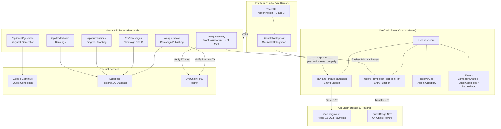
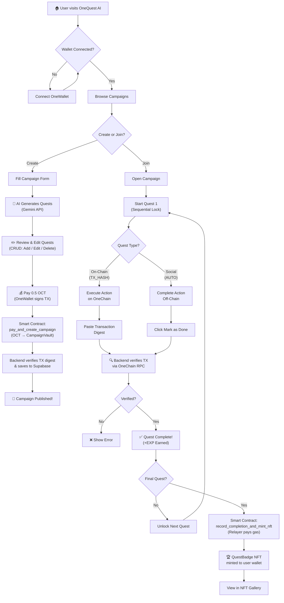

# 🎮 OneQuest AI

**Learn, Quest, Earn — AI-Powered Web3 Onboarding on OneChain**

---

## 🎯 Mission

To streamline Web3 education and user onboarding (specifically on OneChain) through AI-structured, interactive quests with direct on-chain verification.

---

## ❓ The Problem

Onboarding new users into Web3 applications is confusing and involves a steep learning curve. Users frequently drop off due to a lack of clear, step-by-step guidance. Meanwhile, Web3 communities struggle to automatically and accurately verify member participation.

---

## 💡 Our Solution

An AI-driven onboarding quest platform built on the OneChain network. Community creators can rapidly design and structure educational campaigns using AI generation. Users complete these sequentially structured quests, prove their participation via on-chain transactions, and receive a gasless NFT reward upon completion.

---

## 🏗️ Architecture Overview



---

## ⚡ Core Features

- **AI-Assisted Campaign Creation**: Automatically generate quest structures and step-by-step instructions using AI. Includes full CRUD capabilities, giving creators complete control to review, edit, or manually add to the AI-generated output before publishing.

- **Automated On-Chain Verification**: Instantly and accurately verify user actions by tracking Transaction Digests (Hashes) directly on the OneChain blockchain.

- **Sequential Progression**: Enforces a strict, step-by-step completion order (from step 1 to the end) to ensure a comprehensive and logical learning path for new users.

- **Gasless NFT Rewards**: Utilizes a backend Relayer system to subsidize gas fees. Upon completing the final quest, an NFT badge is automatically minted and sent to the user's wallet with zero gas cost to them.

- **Seamless OneWallet Integration**: Directly integrates with the OneWallet ecosystem to simplify transaction verification, asset storage, and Web3 identity management.

---

## 📁 Project Structure

```
OneQuestAI/
├── README.md
│
├── SC/                                       # Move Smart Contract
│   ├── Move.toml                             # Package config (oneQuest)
│   ├── sources/
│   │   └── onequest.move                     # Core contract module
│   │       ├── RelayerCap                    #   Admin capability object
│   │       ├── CampaignVault                 #   Shared vault for OCT payments
│   │       ├── QuestBadge                    #   NFT badge (key + store)
│   │       ├── pay_and_create_campaign()     #   Pay 0.5 OCT to create campaign
│   │       └── record_completion_and_mint_nft()  # Mint NFT to user (relayer)
│   └── tests/
│       └── onequest_tests.move               # End-to-end + invalid payment tests
│
├── onequest-ai/                              # Next.js Frontend + Backend
│   ├── app/
│   │   ├── page.tsx                          # Landing page (hero, stats, features)
│   │   ├── layout.tsx                        # Root layout with providers
│   │   ├── globals.css                       # Global styles & design tokens
│   │   ├── admin/
│   │   │   └── page.tsx                      # Admin dashboard
│   │   ├── campaigns/
│   │   │   └── page.tsx                      # Campaign list + completion badges
│   │   ├── campaign/
│   │   │   └── [id]/
│   │   │       ├── page.tsx                  # Campaign detail (quest progress)
│   │   │       └── quest/
│   │   │           └── [questId]/
│   │   │               └── page.tsx          # Quest detail + proof submission
│   │   ├── create/
│   │   │   └── page.tsx                      # AI quest generation + CRUD review
│   │   ├── docs/
│   │   │   └── page.tsx                      # Documentation page
│   │   ├── leaderboard/
│   │   │   └── page.tsx                      # EXP leaderboard
│   │   ├── my-nfts/
│   │   │   └── page.tsx                      # NFT gallery (dynamic names)
│   │   ├── api/
│   │   │   ├── campaigns/
│   │   │   │   ├── route.ts                  # GET all active campaigns
│   │   │   │   ├── batch/route.ts            # POST batch title lookup
│   │   │   │   └── [id]/route.ts             # GET/DELETE single campaign
│   │   │   ├── quest/
│   │   │   │   ├── generate/route.ts         # POST AI generation (Gemini)
│   │   │   │   ├── save/route.ts             # POST publish (verify payment)
│   │   │   │   └── verify/route.ts           # POST verify proof + NFT mint
│   │   │   ├── quests/[id]/route.ts          # GET single quest details
│   │   │   ├── submissions/route.ts          # GET user submissions
│   │   │   └── leaderboard/route.ts          # GET global leaderboard
│   │   └── components/ui/                    # Reusable UI components
│   │       ├── AnimatedButton.tsx
│   │       ├── Confetti.tsx
│   │       ├── ConfirmModal.tsx
│   │       ├── ConnectWalletButton.tsx
│   │       ├── FloatingInput.tsx
│   │       ├── FloatingSelect.tsx
│   │       ├── GlassCard.tsx
│   │       ├── LoadingSpinner.tsx
│   │       ├── Navbar.tsx
│   │       ├── NFTReveal.tsx
│   │       ├── ParticleBackground.tsx
│   │       ├── QuestCard.tsx
│   │       ├── Toast.tsx
│   │       └── WalletGate.tsx
│   ├── lib/
│   │   ├── client.ts                         # Supabase + RPC + Relayer setup
│   │   └── retry.ts                          # Retry utility for RPC calls
│   ├── package.json
│   ├── next.config.ts
│   ├── tsconfig.json
│   └── .env                                  # Environment variables
```

---

## 🛠️ Tech Stack

| Layer              | Technology                                                              |
|--------------------|-------------------------------------------------------------------------|
| **Framework**      | Next.js 16 (App Router, Turbopack)                                     |
| **Language**       | TypeScript (Frontend/Backend), Move (Smart Contract)                   |
| **Frontend**       | React 19, Framer Motion, React Icons                                   |
| **Styling**        | CSS Variables, Glassmorphism Design System                             |
| **AI**             | Google Gemini AI (`@google/generative-ai`)                             |
| **Blockchain**     | OneChain (Sui Fork) — Move Smart Contracts                             |
| **Smart Contract** | Move language, One Framework (`one::object`, `one::transfer`, `one::coin`) |
| **Wallet**         | `@onelabs/dapp-kit` + `@onelabs/sui`                                  |
| **Database**       | Supabase (PostgreSQL)                                                  |
| **State**          | React Query (`@tanstack/react-query`)                                  |
| **Testing**        | Move test framework (`one::test_scenario`)                             |
| **Deployment**     | Node.js runtime (Frontend), OneChain Testnet (Contract)                |

---

## 🚀 Quick Start

### Prerequisites

- **Node.js** ≥ 18
- **npm** or **yarn**
- **One CLI** — for building and deploying the Move smart contract
- **OneWallet** browser extension

### 1. Clone the Repository

```bash
git clone https://github.com/your-username/OneQuestAI.git
cd OneQuestAI
```

### 2. Deploy the Smart Contract

```bash
cd SC

# Build the Move package
one move build

# Run the contract tests
one move test

# Deploy to OneChain Testnet
one client publish --gas-budget 100000000
```

After deployment, note down:
- **Package ID** → `NEXT_PUBLIC_PACKAGE_ID`
- **CampaignVault Object ID** → `NEXT_PUBLIC_CAMPAIGN_VAULT_ID`
- **RelayerCap Object ID** → `RELAYER_CAP_ID`

### 3. Set Up the Frontend & Backend

```bash
cd ../onequest-ai

# Install dependencies
npm install

# Configure environment variables
cp .env.example .env
```

Edit `.env` with your values:

```env
# AI
GEMINI_API_KEY=your_gemini_api_key

# Database (Supabase)
NEXT_PUBLIC_SUPABASE_URL=your_supabase_url
SUPABASE_SERVICE_KEY=your_supabase_service_key

# Blockchain (OneChain) — from contract deployment
NEXT_PUBLIC_PACKAGE_ID=your_deployed_package_id
RELAYER_CAP_ID=your_relayer_cap_object_id
NEXT_PUBLIC_CAMPAIGN_VAULT_ID=your_campaign_vault_object_id
RELAYER_MNEMONIC=your_relayer_wallet_mnemonic
```

### 4. Run the Development Server

```bash
npm run dev
```

Open [http://localhost:3000](http://localhost:3000) in your browser.

### Production Build

```bash
npm run build
npm start
```

---

## 🔄 Application Flow



---

<p align="center">
  Built with ❤️ on <strong>OneChain</strong>
</p>
